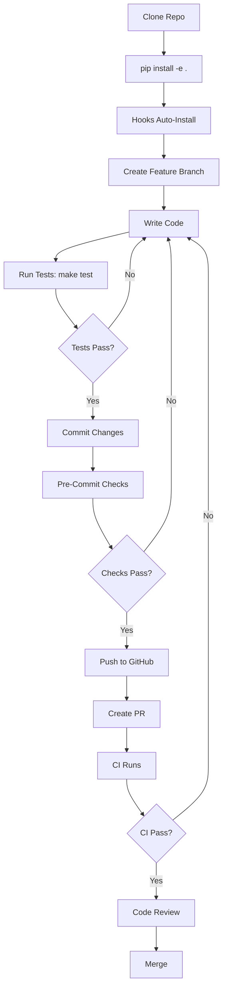

# Plan: Making Clean Contributions Easier

## Executive Summary

The continuous-wave project already has strong contribution infrastructure with comprehensive CI/CD, pre-commit hooks, and testing. This plan focuses on **reducing friction** and **automating quality checks** to make clean patches effortless.

## Current State Assessment

### ✅ Strengths
- Comprehensive CI/CD pipeline (GitHub Actions)
- Dual pre-commit hook systems (native bash + framework)
- Strict type checking with MyPy
- 90% test coverage requirement
- Clear documentation (CONTRIBUTING.md, DESIGN.md)
- Claude Code SessionStart automation
- Make targets for all common tasks

### 🔧 Improvement Opportunities
1. Pre-commit hooks not installed automatically
2. Type checking has 42 suppressed errors
3. No automatic code formatting on save
4. Limited troubleshooting documentation
5. Pre-commit checks take 30-60 seconds (no incremental mode)
6. No visual feedback during long-running checks

---

## Improvement Plan

### Phase 1: Automated Setup (Immediate Impact)

#### 1.1 Auto-Install Pre-Commit Hooks
**Problem:** Contributors must manually run `./hooks/install-hooks.sh`

**Solution:**
- Add post-install script to `pyproject.toml` using `setuptools`
- Auto-install hooks on `pip install -e .`
- Enhance `.claude/SessionStart` to verify hooks are installed
- Add verification in `make install-dev`

**Implementation:**
```python
# In setup.py or pyproject.toml [tool.setuptools.cmdclass]
import subprocess
from setuptools import setup
from setuptools.command.develop import develop

class PostDevelopCommand(develop):
    def run(self):
        develop.run(self)
        subprocess.run(['./hooks/install-hooks.sh'])
```

**Impact:** Zero-friction setup for new contributors

---

#### 1.2 Fast Pre-Commit Mode
**Problem:** Full checks take 30-60 seconds, slowing down commit workflow

**Solution:**
- Add `QUICK_MODE` environment variable to pre-commit hook
- Quick mode: Format + lint changed files only (5-10 seconds)
- Full mode: All checks including tests (existing behavior)
- Add `git config` option to set default mode

**Implementation:**
```bash
# In hooks/pre-commit
if [ "${QUICK_MODE:-0}" = "1" ]; then
    # Only run on staged files
    make format lint
else
    # Full CI checks
    make pre-commit
fi
```

**Usage:**
```bash
# Quick commits during development
QUICK_MODE=1 git commit -m "WIP: testing feature"

# Full checks before PR
git commit -m "feat: complete feature"
```

**Impact:** 5x faster feedback loop for iterative development

---

#### 1.3 IDE Configuration Templates
**Problem:** No standardized IDE settings for consistent formatting

**Solution:**
- Add `.editorconfig` for universal IDE support
- Provide `.vscode/settings.json` template
- Provide `.idea/` (PyCharm) configuration template
- Document in CONTRIBUTING.md

**Files to Create:**
```
.editorconfig           # Universal IDE settings
.vscode/
  ├── settings.json     # VSCode Python config
  ├── extensions.json   # Recommended extensions
  └── launch.json       # Debug configurations
.idea/
  └── codeStyles/       # PyCharm code style
```

**Impact:** Format-on-save, consistent indentation, automatic imports

---

### Phase 2: Enhanced Developer Experience

#### 2.1 Improved Pre-Commit Feedback
**Problem:** Long-running checks provide no progress indication

**Solution:**
- Add progress indicators with spinners/timers
- Show which check is currently running
- Provide estimated time remaining
- Color-coded success/failure messages

**Implementation:**
```bash
#!/bin/bash
# Enhanced pre-commit hook with progress

echo "🔍 Running pre-commit checks..."

run_check() {
    local name=$1
    local cmd=$2
    echo -n "  [$name] Running... "
    start=$(date +%s)

    if eval "$cmd" > /tmp/check-$name.log 2>&1; then
        end=$(date +%s)
        echo "✅ (${$((end-start))}s)"
    else
        end=$(date +%s)
        echo "❌ (${$((end-start))}s)"
        cat /tmp/check-$name.log
        exit 1
    fi
}

run_check "Format Check" "make format-check"
run_check "Lint" "make lint"
run_check "Type Check" "make type-check"
run_check "Tests" "make test"
```

**Impact:** Clear progress, no "black box" waiting

---

#### 2.2 Patch Validation Script
**Problem:** No easy way to validate a patch before creating PR

**Solution:**
- Create `scripts/validate-patch.sh` that runs all CI checks
- Matches GitHub Actions exactly
- Provides detailed failure reports
- Suggests fixes for common issues

**Usage:**
```bash
# Validate current branch against main
./scripts/validate-patch.sh

# Validate specific commit range
./scripts/validate-patch.sh HEAD~3..HEAD
```

**Features:**
- Shows diff stats
- Runs all CI checks
- Validates commit message format
- Checks for merge conflicts
- Verifies changelog updates
- Estimates CI runtime

**Impact:** Catch CI failures locally before pushing

---

#### 2.3 Type Error Resolution Guide
**Problem:** 42 type errors suppressed, no clear path to resolution

**Solution:**
- Enhance `TYPING_ISSUES.md` with resolution examples
- Add type checking levels: `strict`, `normal`, `lenient`
- Create `scripts/check-types.sh` with granular control
- Track type error reduction as a metric

**Implementation:**
```bash
# scripts/check-types.sh
#!/bin/bash

case ${1:-normal} in
  strict)
    # Zero tolerance - fails on any type error
    mypy src/ tests/ --strict --no-error-summary
    ;;
  normal)
    # Current state - allows documented overrides
    mypy src/ tests/
    ;;
  lenient)
    # Only check files without overrides
    mypy src/ tests/ --exclude 'src/continuous_wave/(audio|cli|decode)'
    ;;
esac
```

**Impact:** Progressive type safety improvement

---

### Phase 3: Documentation & Onboarding

#### 3.1 Contribution Workflow Diagram
**Problem:** Text-only documentation, no visual guide

**Solution:**
- Create flowchart for contribution process
- Add to CONTRIBUTING.md as Mermaid diagram
- Show: setup → develop → test → commit → PR

**Example:**


**Impact:** Visual learning for new contributors

---

#### 3.2 Common Issues Troubleshooting Guide
**Problem:** Limited debugging help in docs

**Solution:**
- Add TROUBLESHOOTING.md with FAQ
- Cover common setup issues
- Provide solutions for CI failures
- Include platform-specific issues

**Topics:**
- "Pre-commit hook not found" → reinstall hooks
- "Type check failures" → how to add override
- "Test coverage below 90%" → coverage strategies
- "Import errors" → dependency resolution
- "Audio device errors" → mock audio for testing

**Impact:** Self-service issue resolution

---

#### 3.3 Contribution Checklist Template
**Problem:** Easy to forget steps in contribution process

**Solution:**
- Add pull request template to `.github/PULL_REQUEST_TEMPLATE.md`
- Include checklist for contributors
- Auto-populated in PR description

**Template:**
```markdown
## Description
<!-- Brief description of changes -->

## Type of Change
- [ ] Bug fix
- [ ] New feature
- [ ] Breaking change
- [ ] Documentation update

## Checklist
- [ ] Tests added/updated
- [ ] Type hints included
- [ ] Docstrings added
- [ ] Coverage ≥90%
- [ ] All CI checks pass
- [ ] Self-reviewed code
- [ ] CHANGELOG.md updated

## Testing
<!-- How did you test these changes? -->
```

**Impact:** Consistent, complete PRs

---

### Phase 4: Advanced Quality Tools

#### 4.1 Incremental Type Checking
**Problem:** MyPy checks entire codebase on every commit

**Solution:**
- Use `mypy --cache-fine-grained` for faster re-checks
- Only type-check modified files in quick mode
- Cache type checking results

**Implementation:**
```makefile
# In Makefile
type-check-incremental:
	@git diff --name-only --cached | grep '\.py$$' | xargs -r mypy --cache-fine-grained
```

**Impact:** 10x faster type checking during development

---

#### 4.2 Coverage Diff Reporting
**Problem:** Hard to see if new code meets coverage requirements

**Solution:**
- Add `pytest-cov` diff mode to only check new lines
- Show coverage delta in commit messages
- Fail if new code has <90% coverage

**Implementation:**
```bash
# In pre-commit hook
pytest --cov --cov-report=term-missing:skip-covered --cov-branch \
    --cov-fail-under=90 tests/
```

**Impact:** Focus on covering new code

---

#### 4.3 Auto-Fix Common Issues
**Problem:** Contributors must manually fix linting errors

**Solution:**
- Add `make fix` target that runs all auto-fixers
- Include in pre-commit hook with `--fix` flag
- Auto-fix: imports, formatting, common linting issues

**Implementation:**
```makefile
fix:
	@echo "Auto-fixing code issues..."
	black src/ tests/
	ruff check --fix src/ tests/
	isort src/ tests/
```

**Usage:**
```bash
# Fix all auto-fixable issues
make fix
git add -u
git commit
```

**Impact:** One-command fix for 80% of issues

---

### Phase 5: CI/CD Enhancements

#### 5.1 Fast Fail CI Pipeline
**Problem:** CI runs all checks even if early ones fail

**Solution:**
- Reorder CI jobs by speed and likelihood of failure
- Run formatting/linting first (fast, often fail)
- Run tests after (slower, less likely to fail)
- Parallelize Python version matrix

**Implementation:**
```yaml
# .github/workflows/ci.yml
jobs:
  quick-checks:
    runs-on: ubuntu-latest
    steps:
      - name: Format Check
        run: make format-check
      - name: Lint
        run: make lint
      - name: Type Check
        run: make type-check

  tests:
    needs: quick-checks
    strategy:
      matrix:
        python-version: ["3.11", "3.12", "3.13"]
    # ... test steps
```

**Impact:** Fail fast, save CI minutes

---

#### 5.2 PR Preview Comments
**Problem:** Must navigate to CI logs to see failures

**Solution:**
- Add GitHub Action to comment on PRs with:
  - Coverage delta
  - Linting issues summary
  - Test failure summaries
  - Link to full logs

**Implementation:**
- Use `actions/github-script@v6` to post comments
- Use `py-cov-action/python-coverage-comment-action@v3` for coverage

**Impact:** Instant feedback without leaving PR page

---

#### 5.3 Automated Changelog Updates
**Problem:** Easy to forget updating CHANGELOG.md

**Solution:**
- Add CI check that verifies CHANGELOG.md changed
- Provide template for changelog entries
- Auto-generate draft from commit messages

**Implementation:**
```bash
# scripts/check-changelog.sh
#!/bin/bash
# Verify CHANGELOG.md was updated in PR

if ! git diff origin/main...HEAD --name-only | grep -q CHANGELOG.md; then
    echo "❌ CHANGELOG.md not updated"
    echo "Please add an entry to the Unreleased section"
    exit 1
fi
```

**Impact:** Complete, up-to-date changelogs

---

## Implementation Priority

### 🚀 Quick Wins (1-2 hours)
1. ✅ Add `.editorconfig`
2. ✅ Create `make fix` target
3. ✅ Add progress indicators to pre-commit hook
4. ✅ Create PR template

### 📊 High Impact (1-2 days)
5. ⭐ Auto-install pre-commit hooks
6. ⭐ Add quick mode for pre-commit
7. ⭐ Create patch validation script
8. ⭐ Add contribution workflow diagram

### 🔧 Medium Term (1 week)
9. 📈 Incremental type checking
10. 📈 Coverage diff reporting
11. 📈 Troubleshooting guide
12. 📈 IDE configuration templates

### 🎯 Long Term (2+ weeks)
13. 🎯 Fast-fail CI pipeline
14. 🎯 PR preview comments
15. 🎯 Type error resolution (ongoing)
16. 🎯 Automated changelog checks

---

## Success Metrics

### Developer Experience
- ⏱️ Time from clone to first commit: **<5 minutes**
- ⏱️ Pre-commit feedback time: **<10 seconds (quick mode)**
- 📉 CI failure rate: **<20%** (down from unknown baseline)
- 🔄 Patch rejection rate: **<10%**

### Code Quality
- ✅ Test coverage: **≥90%** (maintained)
- 🔍 Type coverage: **95%+** (up from current ~85%)
- 📦 Pre-commit hook adoption: **100%** (auto-installed)
- 🐛 Bug escape rate: **<5%** (issues found post-merge)

### Contribution Volume
- 👥 Time to first contribution: **<1 day**
- 🎯 Clean patch rate: **>80%** (pass CI first try)
- 📝 Documentation PRs: **10%+** of total PRs

---

## Next Steps

1. **Review this plan** with maintainers
2. **Prioritize** which improvements to implement first
3. **Create issues** for each improvement
4. **Implement** in phases
5. **Measure** success metrics after each phase
6. **Iterate** based on contributor feedback

---

## Questions for Maintainers

1. What's the most common reason contributors' PRs fail CI?
2. How long does it typically take new contributors to get set up?
3. Are there any pain points in the current contribution workflow?
4. What percentage of PRs require multiple rounds of review?
5. Which of these improvements would have the highest impact?

---

## Conclusion

This plan builds on the project's already strong foundation to create a **frictionless contribution experience**. By focusing on automation, fast feedback, and clear documentation, we can make clean patches the default rather than the exception.

The key philosophy: **Make the right thing the easy thing.**
